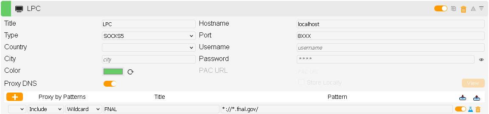

# lpc-scripts
scripts of use on the cmslpc cluster

Table of Contents
=================

* [call_host.sh](#call_hostsh)
   * [Note](#note)
   * [Usage](#usage)
      * [Manual](#manual)
      * [Automatic](#automatic)
   * [Details](#details)
   * [Options](#options)
   * [Caveats](#caveats)
* [bind_condor.sh](#bind_condorsh)
   * [Usage](#usage-1)
   * [Setting up bindings](#setting-up-bindings)
* [get_files_on_disk.py](#get_files_on_diskpy)
* [tunn](#tunn)
   * [Detailed usage](#detailed-usage)
   * [Web browser usage](#web-browser-usage)
* [Unit and Integration testing](#unit-and-integration-testing)
   * [Automated](#automated)
   * [Manual](#manual-1)
      * [Bats for Bash scripts](#bats-for-bash-scripts)
      * [Pytest for Python modules](#pytest-for-python-modules)

<!-- Created by https://github.com/ekalinin/github-markdown-toc -->

## `call_host.sh`

Many commands are installed on interactive nodes but are not accessible inside containers.

The script [call_host.sh](./call_host.sh) enables calling these commands *on the host node* from inside a container.

This is particularly useful for HTCondor commands and EOS commands, among others.

Support is currently guaranteed for the cmslpc cluster at Fermilab, and the CMS Connect and OSG clusters hosted at UChicago.
This script may also work on other clusters, such as lxplus at CERN.

### Note

The examples here use the [`cmssw-el7` command](http://cms-sw.github.io/singularity.html). This is a wrapper around Apptainer for CMS-specific use.

For non-CMS use, replace this command with your usual Apptainer command, e.g.:
```bash
apptainer exec ... /bin/bash
```

### Usage

These instructions assume that you have cloned `lpc-scripts` in your home area:
```bash
cd ~
git clone https://github.com/FNALLPC/lpc-scripts
```

#### Manual

1. Before entering the container:
    ```bash
    source ~/lpc-scripts/call_host.sh
    ```

2. Then enter the container:
    ```bash
    cmssw-el7
    ```

3. Inside the container:
    ```bash
    source ~/lpc-scripts/call_host.sh
    ```

Steps 2 and 3 can be combined:
    ```bash
    cmssw-el7 -- 'source ~/lpc-scripts/call_host.sh && /bin/bash'
    ```

#### Automatic

Whenever you edit your `.bashrc` or `.bash_profile`, you should log out and log back in for the changes to take effect.

1. In your `.bashrc` or `.bash_profile`:
    ```bash
    source ~/lpc-scripts/call_host.sh
    ```
    * To check if this line in your `.bashrc` or `.bash_profile` is being executed when you log in, make sure the following command shows some output:
       ```bash
        echo $APPTAINERENV_APPTAINER_ORIG
        ```

2. To start a container with this in your `.bashrc`:
    ```bash
    cmssw-el7 [options] -- /bin/bash
    ```
    or to start a container with this in your `.bash_profile`:
    ```bash
    cmssw-el7 [options] -- /bin/bash -l
    ```

There are many possible permutations of `bash` login scripts.
If the above options are not working properly for you, you can fall back to the "Manual" approach above.

### Details

What happens:
* The `apptainer` command is replaced with a function that will create a set of pipes on the host node before running `apptainer`.
* Inside the container, all executables starting with `condor_` and `eos` will automatically run on the host node.
* To run other commands on the host node, use `call_host cmd`, where `cmd` is the command you want to run (with any arguments).
* Nested containers are supported (the enable/disable status (see "Options" just below) is inherited from the top-level container and cannot be changed)

### Options

The `export` lines below can be executed manually,
placed in your `.bashrc` or `.bash_profile`,
or placed in a file `~/.callhostrc` (automatically detected and sourced by `call_host.sh`).

* Before sourcing the script, you can use this line to change the directory where the pipes will be created:
    ```bash
    export CALL_HOST_DIR=your_dir
    ```
    The default directory for cmslpc is `~/nobackup/pipes`, and for CMS connect / OSG is ``/scratch/`whoami`/pipes``.
    For other clusters, you must specify the directory (no other programmed defaults are currently provided).
* If you want to run additional executables or functions automatically on the host node, you can add a line like this with a space-separated list (replace the example commands with the commands you want):
    ```bash
    export CALL_HOST_USERFNS="display gs"
    ```
* If you want to disable this by default and only enable it on the fly, use the following syntax (which sets the variable value to `disable` only if it is currently unset, in order to facilitate temporary enabling):
    ```bash
    export CALL_HOST_STATUS=${CALL_HOST_STATUS:=disable}
    ```
    Use the dedicated toggle to enable it for the rest of your session (or until another toggle is called):
    ```bash
    call_host_enable
    ```
    or just enable it for one container invocation:
    ```bash
    CALL_HOST_STATUS=enable cmssw-el7 ...
    ```
* Instead, if you have this enabled by default and want to disable it on the fly:  
    Use the dedicated toggle to disable it for the rest of your session (or until another toggle is called):
    ```bash
    call_host_disable
    ```
    or just disable it for one container invocation:
    ```bash
    CALL_HOST_STATUS=disable cmssw-el7 ...
    ```

### Caveats

* cmslpc autodetection of the correct operating system for jobs is currently based on the host OS. Therefore, if you are submitting jobs in a container with a different OS, you will have to manually specify in your JDL file (the `X` in `condor_submit X`):
    ```
    +DesiredOS = SL7
    ```
    (other possible values are EL8 or EL9)
* If you are running in a non-CMS container, then you should manually set a different line in your JDL file:
    ```
    +ApptainerImage = "/path/to/your/container"
    ```
* Using the `ENV()` function in the JDL file may not function as intended, since it will be evaluated on the host node, rather than inside the container with your environment set up.
* Commands that require tty input (such as `nano` or `emacs -nw`) will not work with `call_host`.
* Occasionally, if a command fails (especially when calling multiple commands separated by semicolons), the pipe will break and the terminal will appear to hang. The message "Interrupted system call" may be shown.
    It is necessary to exit and reenter the container (in order to create a new pipe) if this occurs.
    To prevent this, chain multiple commands using logical operators (`&&` or `||`), or surround all the commands in `()` (thereby running them in a subshell).
* Stopping a command in progress with ctrl+C is disabled (to avoid breaking the pipe as described in the previous item).
* Suspending a command with ctrl+Z is not supported and may break the session.

## `bind_condor.sh`

It is also possible to use the HTCondor Python bindings inside a container.
This requires correctly specifying the HTCondor configuration.
A simple approach is provided in [bind_condor.sh](./bind_condor.sh).

Support is currently provided for the cmslpc cluster at Fermilab, the lxplus cluster at CERN, and the CMS Connect and OSG clusters hosted at UChicago.

### Usage

In your `.bashrc`:
```bash
source bind_condor.sh
```
That's it!

### Setting up bindings

You will also need to have the HTCondor Python bindings installed in your working environment.

For newer CMSSW versions, the installation procedure is simple:
```bash
cmsrel CMSSW_X_Y_Z
cd CMSSW_X_Y_Z/src
cmsenv
scram-venv
cmsenv
pip3 install htcondor
```
(Click [here](http://cms-sw.github.io/venv.html) to learn more about `scram-venv`)

For `CMSSW_10_6_X`, the Run 2 ultra-legacy analysis release that is only available for EL7 operating systems, there are some extra steps:
```bash
cmsrel CMSSW_10_6_30
cd CMSSW_10_6_30/src
cmsenv
scram-venv
cmsenv
pip3 install --upgrade pip
cmsenv
pip3 install htcondor
```
In this particular case, it is necessary to upgrade `pip` because the Python version in `CMSSW_10_6_X` is old (Python 3.6.4).
`pip` should then automatically install a compatible version of the bindings.

**NOTE**: These recipes only install the bindings for Python3. (Python2 was still the default in `CMSSW_10_6_X`.)
You will need to make sure any scripts using the bindings are compatible with Python3.

## `get_files_on_disk.py`

This script automates the process of querying Rucio to find only the files in a CMS data or MC sample that are currently hosted on disk.
(The most general form of this functionality is not currently available from other CMS database tools such as `dasgoclient`.)

There are two major use cases for this tool:
1. Finding AOD (or earlier formats such as RECO or RAW) files for testing or development. (AOD samples are not hosted on disk by default, so typically only small subsets of a sample will be transferred to disk for temporary usage.)
2. Obtaining file lists for premixed pileup samples for private MC production. (Premixed pileup input samples are no longer fully hosted on disk because of resource limitations.)

A fraction of each premixed pileup sample is subscribed to disk by the central production team, and the corresponding list of files is synced to cvmfs.
By default, this script will just copy this cached information.
This is the most stable and preferred approach, so only deviate from it if absolutely necessary.

This script should *not* be run in batch jobs, as that can lead to an inadvertent distributed denial of service disruption of the CMS data management system.
The script will actively try to prevent you from running it in batch jobs.
Please run the script locally, before submitting your jobs, and send the resulting information as part of the job input files.

The available options for this script are:
```
usage: get_files_on_disk.py [-h] [-a [ALLOW ...] | -b [BLOCK ...]] [-o OUTFILE] [-u USER] [-v] [--no-cache] dataset

Find all available files (those hosted on disk) for a given dataset

positional arguments:
  dataset               dataset to query

optional arguments:
  -h, --help            show this help message and exit
  -a [ALLOW ...], --allow [ALLOW ...]
                        allow only these sites (default: None)
  -b [BLOCK ...], --block [BLOCK ...]
                        block these sites (default: None)
  -o OUTFILE, --outfile OUTFILE
                        write to this file instead of stdout (default: None)
  -u USER, --user USER  username for rucio (default: [user])
  -v, --verbose         print extra information (site list) (default: False)
  --no-cache            do not use cached file lists from cvmfs (default: False)
```

## `tunn`

A simple utility to create and manage SSH tunnels.

The basic usage of `tunn` follows this pattern:
1. `tunn make user@cmslpc-el9.fnal.gov`
2. `tunn list`:
    ```
    index: socket port command
    0: "/home/[user]/.tsock_xyz" 8XXX "user@cmslpc-el9.fnal.gov"
    ```
3. `tunn kill 0`:
    ```
    Exit request sent.
    ```

If you have host aliases defined in your `~/.ssh/config` file, you can use them with `tunn`.

### Detailed usage

The configuration and command-line options for `tunn` are described in its usage message:
```
tunn [operation] [options] [arguments]

Default settings are obtained from the config file at /home/[user]/.tunnconfig.
To override the config file location, put this in your .bashrc or other login file:
    export TUNN_CONFIG=/my/preferred/file
The available config variables are: TUNN_PREFIX, TUNN_PORT, TUNN_VERBOSE.
Their values should be specified in the config file using bash syntax, e.g.:
    TUNN_PORT=8XXX
(If TUNN_PORT is not specified in the config file or via the command line option,
the default value is taken from the last three digits of your UID.)

Operations:

make         make new tunnel
    -n [name]        tunnel socket name prefix (default: /home/[user]/.tsock)
    -p [port]        tunnel port (default: 8XXX)
    [destination]    ssh destination for tunnel (required)

list         list open tunnels

kill         kill specified tunnel
    [index]          index of tunnel (required)

Common options:
-u           (unclean) do not auto-remove closed tunnels from list
-v           toggle verbosity (default: false)
-h           print this message and exit
```

### Web browser usage

There are addons available for web browsers to route traffic through ssh tunnels.
[FoxyProxy](https://getfoxyproxy.org/downloads/) is recommended for most browsers (Chrome, Firefox, and derivatives; Safari has [equivalent internal settings](https://help.getfoxyproxy.org/index.php/knowledge-base/how-to-use-your-proxy-services-with-safari/).)

You can add LPC as a proxy server in the "Proxies" tab, with settings as follows:
* Title: LPC
* Hostname: localhost
* Type: SOCKS5
* Port: [your TUNN_PORT value 8XXX]
* Proxy by patterns: [blank], "Include", "Wildcard", Title: FNAL, Pattern: \*://\*.fnal.gov/

<details>
<summary>Firefox example screenshot:</summary>


</details>

## Unit and Integration testing

### Automated
Some automated linting for both Python and Bash takes place using GitHub Actions. This testing is run on both pushes and pull requests. The jobs use pylint to check the Python code and ShellCheck to do the static checking of the Bash scripts.

### Manual
Much of the code contained here relies on certain mounts (i.e. cvmfs), specific disk systems (eos), or specially installed software (i.e. voms-proxy-init). The codes which rely on these can't be easily tested using automated GitHub Actions jobs. Below you will find some directions on how to manually test the code.

*Please note, these tests do not constitute complete coverage. Some additional manual testing may be necessary.*

#### Bats for Bash scripts

The [Bats](https://bats-core.readthedocs.io/en/stable/) tests are currently setup to test only the `eosdu` executable. Every effort has been made to test all of the options. Even so, full coverage is not guaranteed. These tests rely on the eos path `/store/user/cmsdas/test/` being stable.

First the Bats software needs to be setup. This is a process that only needs to happen once. To setup the software run the following command from within the `<path to lpc-scripts>/lpc-scripts` directory:
```bash
./test/bats_control.sh -s
```

Once the software is setup, you can run the tests using:
```bash
./test/bats_control.sh
```

If everything is working correctly, the output will be:
```
 ✓ Check eosdu basic
 ✓ Check eosdu usage message
 ✓ Check eosdu file count
 ✓ Check eosdu human readable
 ✓ Check eosdu recursive
 ✓ Check eosdu human readable bibytes
 ✓ Check eosdu human readable file count
 ✓ Check eosdu recursive human readable
 ✓ Check eosdu recursive file count
 ✓ Check eosdu recursive human readable file count
 ✓ Check eosdu grep
 ✓ Check eosdu human readable grep
 ✓ Check eosdu file count grep
 ✓ Check eosdu human readable file count grep

14 tests, 0 failures
```

To remove the Bats software run:
```bash
./test/bats_control.sh -r
```

#### Pytest for Python modules

To run the python unit/integration tests, you will need to have pytest installed. Currently the version of pytest in CMSSW_12_1_0_pre3 does not work and there is no pytest module installed on the cmslpc host machines. To create a local virtual environment with pytest installed, use the following commands from within the `<path to lpc-scripts>/lpc-scripts` directory:

```bash
./test/pytest_control.sh -s
```

You only have to run that command when setting up the virtual environment the first time. You can then run the tests by using the command:

```bash
./test/pytest_control.sh
```

You should see an output similar to:
```
========================================================== test session starts ===========================================================
platform linux -- Python 3.6.8, pytest-6.2.5, py-1.10.0, pluggy-1.0.0
rootdir: <path to lpc-scripts>
collected 7 items

test/test.py s......                                                                                                               [100%]

====================================================== 6 passed, 1 skipped in 5.74s ======================================================
```

You can pass addition options to pytest using the `-o` flag. For example, you could run the following command to increase the verbosity of pytest:

```bash
./test/pytest_control.sh -o '--verbosity=3'
```

Other helpful pytest options include:
  - `-rp`: To see the output of successful tests. This is necessary because by default all of the output from the various tests is captured by pytest.
  - `-rx`: To see the output of failed tests (default).

To remove the virtual environment use the command:

```bash
./test/pytest_control.sh -r
```

which will simply remove the `test/venv` directory.
